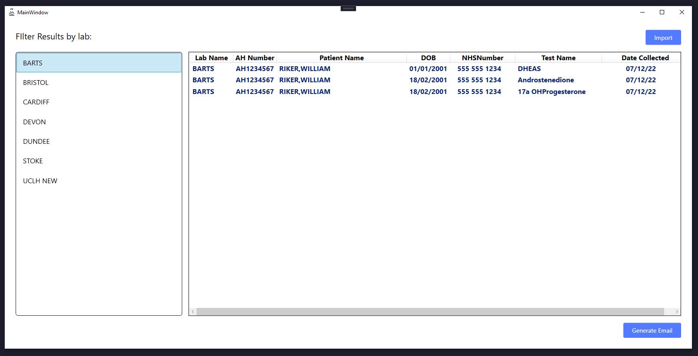

# Outstanding-Report-Generator v1.0

### The problem:

The laboratory sends various samples away to other specialist labs for analysis. Roughly 90% of the time the reports are returned with no issues. However, for whatever reason, some reports do not make it back and stay as outstanding in the system.

This requires a member of staff to pull out data from the labs LIMS in the form of a CSV file and manually go through each outstanding sample per laboratory, sending out emails asking for a copy of the report. This is very laborious and time that could be better spent elsewhere. 

### The solution:

This WPF application will allow the user to import the CSV file and filter outstanding tests by laboratory. Once the lab is selected, the user will be given the option to generate an email detailing the outstanding tests that are required. 

### TODO:

-Be able to edit the email template

-Highlight tests that are in the LIMS but not validated
